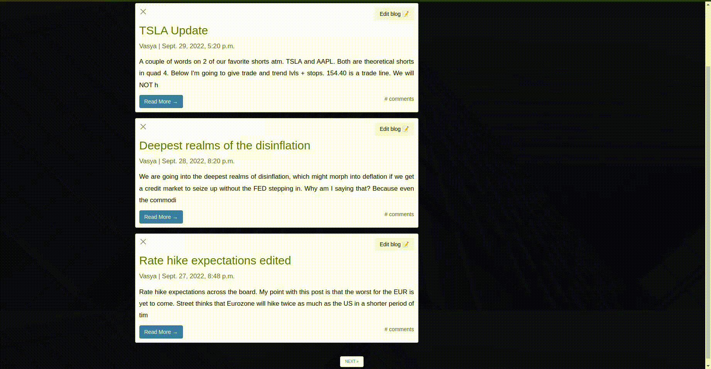

## Project: web-platform for tracking client's portfolio performance

---


#### ✨ Update on: 19.09.2022:

- Added login/sign up pages;
- App is properly configured in Docker;

You can build an image of the app from zero:
```shell
make d-project-i-run
```
To run Postgres DB:
```shell
make d-run-i-local-dev
```
- Added header (early look);

---
#### ✨ Update on: 27.09.2022:

- Fixed login/sign up pages logic;
- Added templates for these pages;
- Added blog app (v.0.1.0). You can click on `Our blog` title in the header to check it out.

---
#### ✨ Update on: 28.09.2022:
- Blog (v.0.2.0). Added comments;
- Added pagination on the `/blogs` page;
- Updated CSS and HTML on the old templates;
- Added 2 new templates for comments feature.

---
#### ✨ Update on: 30.09.2022:
- Blog (v.0.3.0). Added simple CRUD functionality for blogs;
- Updated CSS and HTML;


